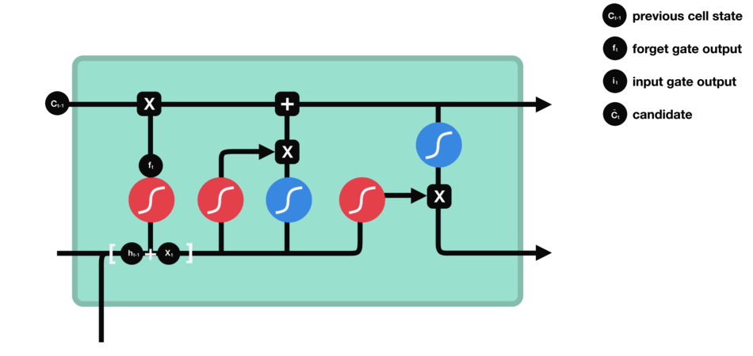
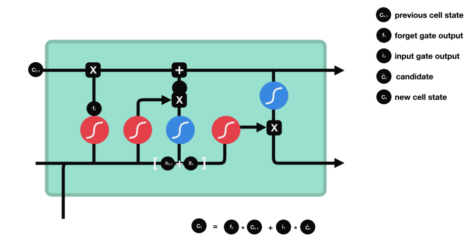

This notebook contains vanilla LSTM Network developed from scratch using numpy library.

**LSTM**: It stands for **L**ong **S**hort **T**erm **M**emory.

It is made up of 4 DNNs performing specific task. 

First is the Input cell,Here in the input cell combines with the output of previous input and goes to the tan gate. The task of the tan gate is to give all possible possibilities. The same combined input is sent to a DNN conneccted to sigmoid gate whose talk is to ignore some possibilities, Then the result is combined my element wise multiplication operation. This results in filtered possibilities goinng further. 

The task of forget gate is to remember history and select possibilities based on history. Therefore it gets combined with the output of the above mentioned operations. 

The result becomes the new memory helping the network remember history.

Finally the combined input goes to the last DNN for the selection, here a combined decision is made requiring putput of selection gate and and history. Then the inference is made and a possibility is selected. 

For more understanding, please refer to [link](https://towardsdatascience.com/illustrated-guide-to-lstms-and-gru-s-a-step-by-step-explanation-44e9eb85bf21)

Few experiments are performed over it to understand it much better.

|SR No. | Experiment | Result |Remark |
| --- | --- | --- | --- |
| 1 | Ran test for 100000 Epochs as one cycle of 50000  | The model fits very well gives an error of 3%| Retrained is allowed as the variables are not refreshed |
| 2 | Ran test for 100000 Epochs as one cycle of 50000 but refereshed the noteball | The model fits very well gives an error of 3%| This leads to disquallification as few variable entries are lost and hence resulting much better convergence |
